# Preface
## [👉Download Here👈](https://github.com/HarmoniaEpic/text-to-officefile-or-wasmapp-recipes_en/archive/refs/heads/main.zip)
## 👉日本語版はこちら👉[text-to-officefile-or-wasmapp-recipes(Japanese)](https://github.com/HarmoniaEpic/text-to-officefile-or-wasmapp-recipes/)
## Please stop! I'm bored!
[Dear Miss Sweetie Poo](https://en.wikipedia.org/wiki/Ig_Nobel_Prize#Ceremony), please accept this. [I beg you, please give me more time and money](https://en.wikipedia.org/wiki/Montana_Jones#Dr._Nitro) in consideration of the gift below.
<br><br>
[PoC-WAT2WASM-RECIPE.md](PoC-WAT2WASM-RECIPE.md)
<br>
Attach the above file to the AI chat and provide instructions such as: “Please create a webpage that generates a WASM program listing prime numbers within the integers 0 to 100, based on the attached recipe.” You will then receive an HTML file or its code, such as the following:
<br>
[prime_numbers_wasm.html](examples/prime_numbers_wasm.html)
## 💣Caution! This product is still PoC!💣
## 🚽Please flush away any complaints as this is a proof of concept🚽
## What is this?
If we could prepare something like a Dockerfile for Docker and create desired files on the browser's sandbox, it would surely be convenient. With the advancement of [SLM](https://www.ibm.com/think/topics/small-language-models) and context window size, it should be possible to run on edge devices too.
<BR><BR>
This repository is the result of shaping the above idea to a working stage using AI. While it seems reasonably useful even at this stage, please feel free to modify it according to your use and needs.
<BR><BR>
We plan to make careful corrections with human review once the operation stabilizes.

<details>
<summary><b>Memo + A few grumbles</b></summary>

- First of all, we need to fix the hyperbolic writing style. Lies, exaggerations, and misleading content are not good.
- Another point is the need to remove duplicate code. It seems that having AI repeatedly modify code causes strange fragments to accumulate.
- Also, unnecessary feature additions. There are cases where it adds half-baked features that weren't requested and destabilizes the code, so we can't let our guard down.
- Regarding Claude, if you don't mandate date retrieval at the beginning of work using projects etc., it tends to put unclear dates in the update history. My instance seems particularly devoted to January 2025.

</details>

## What we can do now with our current recipe
### Browser Sandbox + Python (using Pyodide)
- Generation of Office files (docx, xlsx, pptx, pdf)
- Generation of mathematical formula PNG images (TeX-style mathematical formulas using matplotlib)
### Browser Sandbox + WASM (using AssemblyScript)
- Generation of WASM-optimized standalone HTML web apps
## ⚠️About local execution of recipes⚠️
Contrary to the description in AI-generated text, when actually tested, recipes consistently failed to execute on models running on video cards with 16GB VRAM. It seems that model size is an important limiting factor in addition to context window length.
<br><br>
We're considering verifying this on Colab etc. in the future. It might take time, but inferencing heavyweight models on CPU might also work. Other possibilities include Apple Silicon Macs.

-> It looks promising. With CPU execution, **gpt-oss:20b** produced outputs close to correct. **qwen2.5-coder:32b**, or models with larger parameter counts, are likely to handle more complex recipes.
## Process Flow Comparison with Docker
###### 📄 Recipe System Flow

```mermaid
graph LR
    RS1[📝 Recipe Creation] --> RS2[🤖 AI Processing]
    RS2 --> RS3[📄 HTML Generation]
    RS3 --> RS4[🌐 Browser Execution]
    RS4 --> RS5[⚡ WASM Processing]
    RS5 --> RS6[📊 Document Output<br/>🌐 Web App Execution]
    
    style RS1 fill:#e1f5fe
    style RS2 fill:#c5e1a5
    style RS3 fill:#fff9c4
    style RS4 fill:#ffccbc
    style RS5 fill:#d1c4e9
    style RS6 fill:#b2dfdb
```

###### 🐳 Docker System Flow

## Configuration Comparison between Recipe System and Docker System
**📊 Comparison Table**
| Aspect | Recipe System | Docker |
|------|--------------|---------|
| **Recipe File** | MD File (Markdown) | Dockerfile (Dedicated DSL) |
| **Execution Process** | AI -> HTML -> Browser -> WASM | Build -> Image -> Container |
| **Execution Location** | Client (Browser) | Server/Local (OS) |
| **Processing Engine** | WebAssembly (Pyodide/AssemblyScript) | Native Process |
| **Distribution Unit** | Single HTML File | Container Image |
| **Dependencies** | CDN Dynamic Loading | Included at Image Build |
| **Isolation Method** | Browser Sandbox | Namespace/Cgroup |
| **Network** | CORS Restrictions | Full Access Available |
| **Data Persistence** | File Download | Volume/Bind Mount |
| **Application Field** | Document and Web App Generation, and Many Others | General Applications |
## Possibilities of Recipe + AI + WebAssembly
This recipe system has the following characteristics:
<br>
- Realizes on the browser side what Docker does on the server side
- Constructs solutions on the browser by instructing AI what you want to do in natural language
- Literally provides AI with a “sandbox”
<br>
The above three points are its characteristics. Functions that cannot be realized by AI alone can be achieved by simply outputting HTML based on the premise of building a development environment on the browser sandbox using Pyodide, AssemblyScript, etc., making it an extremely easy and flexible means of expanding AI functionality. As more things become possible with WASI and WASI Sockets, with some ingenuity, it might become possible to have AI design and create an MCP server for a specific purpose on the browser and use it via a proxy server. "Computer Use Anywhere" might not be a dream.

# 🎉 Office Document Auto-Generation Recipe System

[](https://opensource.org/licenses/MIT)
[](https://github.com/HarmoniaEpic/text-to-office-recipes)
[](https://www.python.org/)
[](https://pyodide.org/)

**With AI and recipe files, you can easily auto-generate PowerPoint, Word, Excel, PDF, Math PNG, and WASM-optimized web apps**

Office-type document files & WASM-compatible standalone HTML web app generation recipes with local AI support, MIT license, and selectable two-level privacy protection

---

## 📚 Table of Contents

- [Features](#-features)
- [Demo](#-demo)
- [Quick Start](#-quick-start)
- [Latest Version](#-latest-version)
- [Types of Files You Can Create](#-types-of-files-you-can-create)
- [How to Use](#-how-to-use)
- [Technical Specifications](#-technical-specifications)
- [Security and Privacy](#-security-and-privacy)
- [Use Cases](#-use-cases)
- [Frequently Asked Questions](#-frequently-asked-questions)
- [Forks Welcome](#-forks-welcome)
- [Update History](#-update-history)
- [Supported Environments](#-supported-environments)
- [Troubleshooting](#-troubleshooting)
- [Community](#-community)
- [License](#-license)
- [Acknowledgments](#-acknowledgments)

---
## ✨ Features

### 🚀 **Easy & Fast**
- **Complete in 4 steps** - Select recipe -> Attach AI -> Instruct -> Download
- **Processing time about 10 seconds** - Fast document generation
- **No programming knowledge required** - Anyone can use it

### 🔒 **Safe & Private**
- **Local AI compatible** - Offline inference using Ollama/Jan/Docker Model Runner
- **Document generation is local processing** - In-browser execution with WebAssembly
- **Selectable privacy protection levels** - Choose AI according to use case

### 📄 **Open Source**
- **MIT License** - Free to use, modify, and distribute
- **Commercial use allowed** - Use in business without restrictions
- **Community-driven** - Anyone can create

### 🖼️ **Smart Image Processing**
- **Image placeholder feature (v4.0)** - Available in Word and PowerPoint
- **Default is text-only** - Simple and lightweight documents
- **Placeholder placement with explicit instructions** - Only when instructing "place images" etc.
- **Add images later freely** - Insert actual images after generation
### 🧮 **AssemblyScript**
- **WASM** - Near-native app operating speed
- **In-browser execution** - Works anywhere
- **High design freedom** - Create anything

---

## 🎬 Demo
### With [PPTX RECIPE](PPTX-RECIPE.md)
#### Claude
"Create an HTML download page for a 5-slide sales report presentation for the Dark Lord of the Galactic Empire, based on the attached recipe."
<br><br>

#### ChatGPT
"Create an HTML download page for a 5-slide sales report presentation for the Dark Lord of the Galactic Empire, based on the attached recipe."
<br><br>

#### Gemini
"Create an HTML download page for a 5-slide sales report presentation for the Dark Lord of the Galactic Empire, based on the attached recipe."
<br><br>

#### Perplexity
"Create an HTML download page for a 5-slide sales report presentation for the Dark Lord of the Galactic Empire, based on the attached recipe."
<br><br>

### With [WASM App RECIPE](ASMSCRIPT-OPTIMIZER-RECIPE.md) & [TEMPLATE](ASMSCRIPT-OPTIMIZER-RECIPE-HTMLTEMPLATE.md)
#### "Create a Counter Demo, based on the attached recipe and template."
[Generated counter demo HTML file](examples/assemblyscript-counter-demo.html)
<BR><BR>

#### "Create a Ball Physics Demo, based on the attached recipe and template."
[Generated ball physics demo HTML file](examples/assemblyscript-ball-physics-demo.html)
<BR><BR>

#### "Create an Image Filter Processor, based on the attached recipe and template."
[Generated image filter demo HTML file](examples/assemblyscript-image-filter-processor.html)
<BR><BR>


#### "Create a knockoff of Pong, based on the attached recipe and template."
[Generated game HTML file](examples/assemblyscript-vector-ping.html)
<BR><BR>

##### Prompt Details
```
Please create a Pong clone that meets the following requirements, based on the attached recipe and template:
- WASM-based game engine based on the attached recipe
- Game title with a knockoff feel inspired by Pong
- Single user mode
- 2-user battle mode
- Compatible with keyboard and joystick
- Retro opening screen and single/two-player selection screen, with 8-bit sound effects & background music
- Responsive support
```

## 🚀 Quick Start

### Requirements
- Compatible browser (Chrome, Firefox, Edge, Safari)
- Recipe files (included in this project)
- AI assistant (choose from):
  - **Privacy-focused**: [Ollama](https://ollama.ai/), [Jan](https://jan.ai/), [Docker Model Runner](https://www.docker.com/blog/introducing-docker-model-runner/), [LM Studio](https://lmstudio.ai/) etc. (local AI)
  - **Convenience-focused**: [Claude](https://claude.ai/), [ChatGPT](https://chatgpt.com/), [Gemini](https://gemini.google.com/), [Perplexity](https://www.perplexity.ai/) etc. (cloud AI)
<br>
※ The claim that recipes can run on consumer GPUs seems to be hallucination.

### Start in 30 seconds (using cloud AI)

#### 1️⃣ **Download the project**
```bash
# Download from GitHub
git clone https://github.com/HarmoniaEpic/text-to-office-recipes.git
```
Or [download ZIP file](https://github.com/HarmoniaEpic/text-to-officefile-or-wasmapp-recipes_en/archive/refs/heads/main.zip)

#### 2️⃣ **Choose a recipe and attach to AI**
```
PowerPoint -> PPTX-RECIPE.md
Word -> DOCX-RECIPE.md
Excel -> XLSX-RECIPE.md
PDF -> PDF-RECIPE.md
Math PNG -> Math-RECIPE.md
WASM Web App -> ASMSCRIPT-OPTIMIZER-RECIPE.md
              + ASMSCRIPT-OPTIMIZER-RECIPE-HTMLTEMPLATE.md
```

#### 3️⃣ **Give instructions (Copy & Paste OK)**
```
"Create a 5-slide new product introduction presentation"
```

#### 4️⃣ **Download**
Save the generated HTML -> Open in browser -> Click download button!

### Start with Advanced Privacy Protection (Using Ollama)
※ The claim that recipes described in this repository can run on consumer GPUs seems to be hallucination. ※

<details>
<summary>🔐 Click here for handling confidential documents</summary>

#### 1️⃣ **Install Ollama**
```bash
# Mac/Linux
curl -fsSL https://ollama.ai/install.sh | sh

# Windows
winget install Ollama.Ollama
# Or download the installer from https://ollama.ai
```

#### 2️⃣ **Download a model**
```bash
ollama pull gemma3  # or phi4, llama3, llava, codellama, mistral etc.
```

#### 3️⃣ **Start Ollama**
```bash
ollama serve
```

#### 4️⃣ **Send recipe file to Ollama**
```bash
# Load recipe and give instructions
cat PPTX-RECIPE.md | ollama run gemma3 "Please generate HTML to create a sales report presentation using this recipe"
```

Now you can generate documents offline!
</details>

---

## 📦 Latest Version

| Component | Version | Last Updated | Status |
|-------------|----------|---------|------|
| **Overall Project** | v1.2.1 | 2025-09-21 | ✅ Stable |
| PPTX-RECIPE | v4.0 | 2025-09-17 | ✅ Latest |
| DOCX-RECIPE | v4.0 | 2025-09-17 | ✅ Latest |
| XLSX-RECIPE | v2.0 | 2025-09-17 | ✅ Latest |
| PDF-RECIPE | v2.0 | 2025-09-17 | ✅ Latest |
| Math-RECIPE | v2.0 | 2025-09-17 | ✅ Latest |
| ASMSCRIPT-OPTIMIZER-RECIPE | v1.4.3 | 2025-09-21 | ✅ Latest |

---

## 📝 Types of Files You Can Create

### 🎯 **PowerPoint (.pptx)** - v4.0
Auto-generation of presentation materials
- ✅ Meeting materials, proposals
- ✅ Product introductions, presentation slides
- ✅ Image placeholder function (**Optional** - only with explicit instructions)
- 📄 Recipe: `PPTX-RECIPE.md`

### 📄 **Word (.docx)** - v4.0
Auto-generation of documents and reports
- ✅ Reports, contracts
- ✅ Manuals, announcement documents
- ✅ Tables and image placeholder support (**Optional** - only with explicit instructions)
- 📄 Recipe: `DOCX-RECIPE.md`

### 📊 **Excel (.xlsx)** - v2.0
Auto-generation of spreadsheets and data analysis
- ✅ Sales tables, budget management
- ✅ Graphs, conditional formatting
- ✅ **CSV data auto-import compatible**
- 📄 Recipe: `XLSX-RECIPE.md`

### 📑 **PDF (.pdf)** - v2.0
Auto-generation of printable documents
- ✅ Invoices, receipts
- ✅ Certificates, awards
- ✅ Japanese font support
- 📄 Recipe: `PDF-RECIPE.md`

### 🔢 **Math PNG (.png)** - v2.0
Auto-generation of mathematical formula images
- ✅ Convert TeX format formulas to PNG images
- ✅ Font, color, and size customization
- ✅ Transparent background support
- 📄 Recipe: `Math-RECIPE.md`

### 🔢 **WASM-Optimized Web App (.html)** - v1.4.3
Auto-generation of web apps
- ✅ Game apps
- ✅ Data processing apps
- ✅ Scientific calculation apps
- 📄 Recipe: `ASMSCRIPT-OPTIMIZER-RECIPE.md` and `ASMSCRIPT-OPTIMIZER-RECIPE-HTMLTEMPLATE.md`

---

## 📖 How to Use

### Basic Flow


### How to Choose Recipe Files

| What to Create | Recipe to Use | File Name | Additional Files |
|------------|-----------|-----------|------------|
| Presentations, Slides | PowerPoint Recipe | `PPTX-RECIPE.md` | Not Required |
| Documents, Reports | Word Recipe | `DOCX-RECIPE.md` | Not Required |
| Tables, Graphs | Excel Recipe | `XLSX-RECIPE.md` | CSV File (Optional) |
| Invoices, Certificates | PDF Recipe | `PDF-RECIPE.md` | Not Required |
| Formulas, Math Symbols | Math PNG Recipe | `Math-RECIPE.md` | Not Required |
| WASM-Optimized Web App | Web App Recipe | `ASMSCRIPT-OPTIMIZER-RECIPE.md` | `ASMSCRIPT-OPTIMIZER-RECIPE-HTMLTEMPLATE.md` | 
### Basic Usage
```
1. Select a recipe file (e.g., PPTX-RECIPE.md)
2. Attach to AI
3. Request "Create a 5-slide sales report presentation"
4. Download generated HTML -> Open -> Get PPTX!
```


### Operation Image
- **PowerPoint generation**: Presentations, proposals, reports (images are optional)
- **Word generation**: Contracts, manuals, reports (images are optional)
- **Excel generation**: Sales tables, budget management, data analysis (CSV compatible)
- **PDF generation**: Invoices, certificates, printed materials
- **Math PNG generation**: Mathematical symbols, equations, scientific formulas as images
- **WASM-optimized web app generation**: Web apps requiring high-speed responsiveness (games, data processing, scientific calculations, etc.)

---


### 💬 AI Request Examples (Copy-Paste OK)

#### When you want to create PowerPoint
```
[Steps]
1. Attach PPTX-RECIPE.md
2. Send the following message

Please create a new product introduction presentation.
With the following structure:
1. Title "New Product Introduction"
2. Product Features (3 items)
3. Price and Plans
4. Contact Information
```

#### When you want to use existing data with Excel
```
[Steps]
1. Attach XLSX-RECIPE.md
2. Also attach CSV file
3. Send the following message

Please create a monthly report from the attached CSV data.
- Add graphs
- Calculate totals and averages
- Format for readability
```

##### Preparing CSV Files (for Excel)

Example CSV file:
```csv
Product Name,Quantity,Unit Price,Sales
Laptop,5,80000,400000
Mouse,20,3000,60000
Keyboard,15,5000,75000
```

**Points**:
- Put item names in the first row
- Separate with commas (,)
- Save as UTF-8 or Shift-JIS

#### When you want to create formula images
```
[Steps]
1. Attach Math-RECIPE.md
2. Send the following message

Please create a beautiful image of the Schrödinger equation.
With transparent background and blue text color.
```

#### When you want to create a WASM-optimized web app
```
[Steps]
1. Attach ASMSCRIPT-OPTIMIZER-RECIPE.md
2. Also attach ASMSCRIPT-OPTIMIZER-RECIPE-HTMLTEMPLATE.md
3. Send the following message

Please create a Pong clone that meets the following requirements:
- WASM-based game engine based on attached recipes
- Game title with a knockoff feel inspired by Pong
- Single user mode
- 2-user battle mode
- Keyboard and joystick support
- Retro opening screen with single/two-player selection, and 8-bit style sound effects & background music
- Responsive support
```

---

## 🔧 Technical Specifications

### Architecture

```mermaid
flowchart TD
    A[User] --> B{AI Selection<br/>Privacy Protection Level}
    
    B --> C[🔐 Local AI<br/>Privacy-focused]
    B --> D[☁️ Cloud AI<br/>Convenience-focused]
    
    C --> C1[Ollama<br/>Offline]
    C --> C2[Jan<br/>Offline]
    C --> C3[Docker Model Runner<br/>Offline]
    
    D --> D1[Claude<br/>Internet Required]
    D --> D2[ChatGPT<br/>Internet Required]
    D --> D3[Gemini<br/>Internet Required]
    
    C1 --> E[Generated HTML]
    C2 --> E
    C3 --> E
    D1 --> E
    D2 --> E
    D3 --> E
    
    E --> F[Pyodide WASM<br/>🐍Python Runtime🐍<br/>Library Management]
    E --> G[AssemblyScript<br/>]

    F --> J[Document Generation Libraries]
    G --> K[App Generation Libraries]
    
    J --> F1[python-docx<br/>Word Document Generation]
    J --> F2[openpyxl<br/>Excel Spreadsheet Generation]
    J --> F3[python-pptx<br/>PowerPoint Generation]
    J --> F4[reportlab<br/>PDF Generation]
    J --> F5[matplotlib<br/>Math PNG Generation]

    K --> G1[asc<br/>AssemblyScript Compiler]

    F1 --> H[📄 Office Documents<br/>Local Save]
    F2 --> H
    F3 --> H
    F4 --> H
    F5 --> H

    G1 --> I[🌐 WASM-Optimized WebApp<br/>Local Save]

    style A fill:#f9f,stroke:#333,stroke-width:2px
    style B fill:#fff,stroke:#333,stroke-width:2px
    style C fill:#9f9,stroke:#333,stroke-width:2px
    style D fill:#9cf,stroke:#333,stroke-width:2px
    style E fill:#ff9,stroke:#333,stroke-width:2px
    style F fill:#f96,stroke:#333,stroke-width:2px
    style G fill:#f96,stroke:#333,stroke-width:2px
    style H fill:#9ff,stroke:#333,stroke-width:2px
    style I fill:#9ff,stroke:#333,stroke-width:2px
    style J fill:#ffe4e1,stroke:#333,stroke-width:2px
    style K fill:#ffe4e1,stroke:#333,stroke-width:2px
```



### Core Technologies

- **Runtime Environment**: [Pyodide](https://pyodide.org/) (WebAssembly Python) / [AssemblyScript](https://www.assemblyscript.org/) (High-level language for WebAssembly)
- **UI Framework**: Tailwind CSS
- **Document Generation Libraries**:
  - `python-docx`: Word document generation
  - `openpyxl`: Excel spreadsheet generation
  - `python-pptx`: PowerPoint generation
  - `reportlab`: PDF generation
  - `matplotlib`: Math PNG generation
- **App Generation Libraries**
  - `asc`: App engine generation

### System Requirements (When Using Cloud AI)

| Item | Minimum Requirements | Recommended Requirements |
|-----|---------|---------|
| **Browser** | Chrome 57+, Firefox 52+, Safari 11+, Edge 16+ | Latest version |
| **Memory** | 2GB RAM | 4GB RAM or more |
| **Network** | Broadband connection (always on) | High-speed broadband |
| **JavaScript** | Must be enabled | - |
| **WebAssembly** | Support required | - |
| **Storage** | 100MB (for cache) | 500MB or more |

### System Requirements (When Using Local AI)
⚠️ The following AI-generated section was hallucinating. Based on actual measurements, models with **20B parameters or more** are required for correct interpretation of the recipes. ⚠️


#### 📊 **Hardware Requirements**

| Item | Minimum Requirements | Standard Recommendation | Comfortable Operation |
|-----|---------|---------|---------|
| **CPU** | 4 cores 2.5GHz or higher | 8 cores 3.0GHz or higher | 12 cores or more |
| **Memory (RAM)** | 8GB | 16GB | 32GB or more |
| **GPU** | None (CPU inference possible) | 8GB VRAM<br/>(RTX 3060 etc.) | 12GB+ VRAM<br/>(RTX 4070 etc.) |
| **Storage** | 50GB free space | 100GB SSD | 200GB+ NVMe SSD |
| **OS** | Windows 10<br/>macOS 10.15<br/>Linux (Ubuntu 20.04+) | Latest 64bit OS | Same as left |

<details>
<summary>🤖 <b>Detailed Configuration Guide (Click to expand)</b></summary>

#### 🤖 **LLM Model Requirements**

| Memory Capacity | Recommended Model | Quantization | Context | Recipe Support |
|-----------|-----------|--------|------------|-----------|
| **8GB** | Phi-3.5 7B | Q3_K_M/Q4_K_S | 8K | Basic documents |
| **10-12GB** | Llama 3.1 8B | Q4_K_M | 16-24K | Single recipe |
| **16GB** | Llama 3.1 8B | Q5_K_M/Q6_K | 32K | All recipes supported ⭐ |
| **24GB+** | Llama 3.1 8B | Q6_K/Q8_0 | 64-128K | Complex requirements |

#### 📏 **Context Window Requirements**

| Use | Required Context | Compatible Model Examples |
|-----|----------------|------------|
| **Math-RECIPE only** | 8K or more | Almost all models |
| **Single recipe use** | 16K or more | Standard 7-9B models |
| **All recipes support** | 32K or more ⭐ | Llama 3.1, Qwen 2.5, etc. |
| **Complex customization** | 64K or more | Latest extended models |

#### 🔧 **Optimal Configuration by Memory**

| System Memory | Optimal Settings | Expected Performance |
|--------------|-----------|---------------|
| **8GB** | • Phi-3 Q4_K_S<br/>• 8K context<br/>• CPU inference | Basic document generation possible<br/>Processing time: 30-60 seconds |
| **12GB** | • Llama 3.1 8B Q4_K_M<br/>• 16K context<br/>• GPU inference recommended | Sufficient for standard use<br/>Processing time: 15-30 seconds |
| **16GB** | • Llama 3.1 8B Q6_K<br/>• 32K context<br/>• GPU inference | Comfortable operation ⭐<br/>Processing time: 10-20 seconds |
| **24GB+** | • Any model<br/>• 128K context<br/>• Multi-GPU possible | Highest performance<br/>Processing time: 5-15 seconds |

#### 💻 **Recommended Configuration by GPU**

| GPU | VRAM | Recommended Model Settings | Notes |
|-----|------|---------------|------|
| **CPU only** | - | 7B Q3_K_M, 8K ctx | Slow but operational |
| **RTX 3060** | 12GB | 8B Q5_K_M, 32K ctx | Good cost-performance |
| **RTX 4060** | 8GB | 8B Q4_K_M, 16K ctx | Entry level |
| **RTX 4070** | 12GB | 8B Q6_K, 32K ctx | Ideal ⭐ |
| **RTX 4080** | 16GB | 8B FP16, 64K ctx | Professional |
| **Mac M2** | 16GB unified | 8B Q6_K, 32K ctx | Excellent efficiency |

#### 🌐 **Network Requirements**

| Stage | Necessity | Use |
|-----|--------|------|
| **Initial Setup** | Required (high speed recommended) | • Ollama/Jan installation<br/>• Model download (3-15GB) |
| **After 2nd time** | Required (for CDN) | • Pyodide library loading<br/>• Can use cache after first time |
| **During model execution** | Not required | • Can work offline |

#### 📦 **Software Requirements**

| Software | Version | Use |
|------------|-----------|------|
| **Ollama** | Latest version | LLM runtime environment |
| **Python** | Not required | Runs on WebAssembly |
| **CUDA** | 11.8 or higher (when using NVIDIA GPU) | GPU acceleration |

#### ⚡ **Performance Expectations (Exaggerated advertising or hallucination)**

| Configuration Level | Processing Time* | Quality | Monthly Cost |
|-----------|----------|------|-----------|
| **Minimum Configuration**<br/>8GB RAM, CPU | 30-60 seconds | 93-95% | ¥0 |
| **Standard Configuration**<br/>16GB RAM, RTX 3060 | 15-25 seconds | 97-99% | ¥0 |
| **Recommended Configuration** ⭐<br/>16GB RAM, RTX 4070 | 10-20 seconds | 99%+ | ¥0 |
| **High-end**<br/>32GB RAM, RTX 4080 | 5-15 seconds | 99.5%+ | ¥0 |

※ Estimate for standard Office document generation
<br>
※ Zero cost is hallucination. Not accounting for electricity costs or GPU depreciation is unfair.
</details>

---

## 🔒 Security and Privacy

### Privacy Protection Levels by AI Model Selection

This system has different security and privacy levels depending on the AI used.

#### 🔐 **High Level: When Using Local AI (Ollama/Jan/Docker Model Runner)**

**Achieves high privacy protection**
<br>
※ This does not apply when using contaminated or malicious models
<br>
※ For local AI, pay particular attention to the source of models and the trustworthiness of model providers

| AI | Features | Privacy Protection Level |
|-----|------|------------------|
| **[Ollama](https://ollama.ai/)** | LLM operation platform running locally | ⭐⭐⭐⭐⭐ Advanced protection |
| **[Jan](https://jan.ai/)** | Offline-compatible LLM operation platform | ⭐⭐⭐⭐⭐ Advanced protection |
| **[Docker Model Runner](https://www.docker.com/blog/introducing-docker-model-runner/)** | Containerized LLM operation platform | ⭐⭐⭐⭐⭐ Advanced protection |

**Advantages:**
- ✅ **Offline operation** - No internet connection required after model download
- ✅ **Zero data leak risk** - No external communication during inference process
- ✅ **Safe processing of confidential documents** - Corporate secrets and personal information are secure

**Disadvantages:**
- ⚠️ Initial setup required
- ⚠️ Depends on local machine specs
- ⚠️ Model download required (several GB to tens of GB)

#### ☁️ **Standard Level: When Using Cloud AI (Claude/ChatGPT)**

**Convenience-focused option**
※ If you don't want your input to be used for model training, use a paid plan with data protection

| AI | Features | Privacy Protection Level |
|-----|------|------------------|
| **Claude** | Anthropic's AI | ⭐⭐⭐ Standard protection |
| **ChatGPT** | OpenAI's AI | ⭐⭐⭐ Standard protection |
| **Gemini** | Google's AI | ⭐⭐⭐ Standard protection |

**Advantages:**
- ✅ **No setup required** - Start using immediately
- ✅ **High-performance AI models** - Latest language models
- ✅ **Always up-to-date** - Automatic updates

**Cautions:**
- ⚠️ **Recipes and requests are sent to AI services**
- ⚠️ **Generated HTML code is returned via AI**
- ⚠️ **Must comply with AI service terms of use**

**However:**
- ✅ Office file creation after generation is completed in the browser
- ✅ Final document data is processed locally
- ✅ Downloaded files are not sent externally

### Data Flow Comparison

#### 🔐 **Data Flow When Using Ollama/Jan**
```
Local Processing:
1. Recipe file -> Local AI (Ollama/Jan) ✅ Local
2. HTML generation -> Completed locally ✅ Local
3. Browser execution -> WebAssembly processing ✅ Local
4. File generation -> Local download ✅ Local
※ No external communication at all (except CDN)
```

#### ☁️ **Data Flow When Using Claude/ChatGPT**
```
Hybrid Processing:
1. Recipe file -> Cloud AI ⚠️ External transmission
2. HTML generation -> Received from AI ⚠️ External communication
3. Browser execution -> WebAssembly processing ✅ Local
4. File generation -> Local download ✅ Local
```

### Recommended Usage

| Use Case | Recommended AI | Reason |
|-----|--------|------|
| **Confidential documents, personal information** | Ollama/Jan | Advanced privacy protection |
| **Corporate internal documents** | Ollama/Jan | Low information leak risk |
| **General documents** | Claude/ChatGPT | Balance of convenience and performance |
| **Testing, learning** | Claude/ChatGPT | No setup required |

### Security Best Practices

#### 1. **When handling highly confidential documents**
```bash
# Install Ollama (Mac/Linux)
curl -fsSL https://ollama.ai/install.sh | sh

# Download model
ollama pull gemma3

# Start using
ollama serve
```

#### 2. **When handling general documents**
- Check cloud AI terms of use
- Don't include personal or confidential information
- Verify generated HTML before executing

#### 3. **Common safety measures**
- ✅ Keep browser up-to-date
- ✅ Use on trusted networks
- ✅ Virus scan generated files
- ✅ Regularly clear browser cache

### Privacy Protection Level Evaluation

| Item | Ollama/Jan | Claude/ChatGPT |
|------|------------|----------------|
| Recipe file destination | Local only | AI service |
| HTML generation location | Local | AI service |
| Document generation processing | In browser | In browser |
| Final file | Local save | Local save |
| Internet necessity | Not required※ | Required |
| **Overall rating** | ⭐⭐⭐⭐⭐ | ⭐⭐⭐ |

※ Except for library loading from CDN

---

## ✨ Use Cases

### 🏢 **Business Scenarios**

| Situation | Request Example | Recipe to Use | Recommended AI |
|----------------|--------|-----------|--------|
| Urgent meeting materials | "Create a business plan presentation that can be explained in 15 minutes" | PPTX | Claude/ChatGPT |
| Monthly report (internal) | "Create an analysis report from last month's sales data" | XLSX + CSV | Ollama/Jan |
| Quote creation | "Create a quote for website production" | PDF | Claude/ChatGPT |
| Confidential contracts | "Create a business outsourcing contract template" | DOCX | Ollama/Jan |
| Employee evaluation | "Create an employee evaluation form" | XLSX | Ollama/Jan |
| Internal tools | "Create benchmark software" | WASMAPP | Ollama/Jan |

### 🎓 **Education & Learning**

| Situation | Request Example | Recipe to Use | Recommended AI |
|----------------|--------|-----------|--------|
| Class materials | "Create 10 slides for history class" | PPTX | Claude/ChatGPT |
| Report creation | "Create a report structure about environmental issues" | DOCX | Claude/ChatGPT |
| Grade management | "Create a grade management table for 30 students" | XLSX | Ollama/Jan |
| Certificate issuance | "Create a programming course certificate" | PDF | Claude/ChatGPT |
| List with personal info | "Create a student contact list" | XLSX | Ollama/Jan |
| Math teaching materials | "Create an image of the quadratic formula" | Math | Claude/ChatGPT |
| Data visualization | "Create a graph calculator" | WASMAPP | Claude/ChatGPT |

### 🏠 **Private**

| Situation | Request Example | Recipe to Use | Recommended AI |
|----------------|--------|-----------|--------|
| Household account book | "Create a household account book that shows monthly income and expenses" | XLSX | Ollama/Jan |
| Travel planning | "Create a 3-night 4-day Kyoto travel plan" | DOCX | Claude/ChatGPT |
| Event invitations | "Create a birthday party invitation" | PDF | Claude/ChatGPT |
| Medical record management | "Create a family health record table" | XLSX | Ollama/Jan |
| Retro games | "Create a Breakout clone" | WASMAPP | Claude/ChatGPT |

**🔐 Security guideline**:
- Contains personal/confidential information -> **Ollama/Jan**
- General content/templates -> **Claude/ChatGPT**

---

## ❓ Frequently Asked Questions

### Basic Questions

<details>
<summary>Q: Is this tool itself free?</summary>

**A:** Yes, this tool itself is open source software under the MIT license. You can freely use, modify, and distribute it. However, please note:
- **When using Claude/ChatGPT**: Usage fees for each AI service may apply
- **When using Ollama/Jan**: The software itself is free, but hardware required for execution and communication costs for downloading models will be incurred
</details>

<details>
<summary>Q: Is an internet connection required?</summary>

**A:** It depends on the AI used:
- **When using Claude/ChatGPT**: Always requires internet connection
- **When using Ollama/Jan**: Can work offline (after initial library download)
</details>

<details>
<summary>Q: Is it safe to handle confidential documents?</summary>

**A:** Privacy protection levels differ by AI choice:
- **Ollama/Jan**: ⭐⭐⭐⭐⭐ High security (local processing)
- **Claude/ChatGPT**: ⭐⭐⭐ Standard security (recipe and requirements sent to AI service)

We strongly recommend using Ollama/Jan for highly confidential documents.
</details>

<details>
<summary>Q: Can I use it on a smartphone?</summary>

**A:** Technically possible, but we recommend using it on a computer. On smartphones, operation may be unstable due to memory shortage.
</details>

<details>
<summary>Q: I want to create documents with images?</summary>

**A:** From v4.0, image placeholders became an optional feature:
- **Default behavior**: Clean text-only documents are generated
- **When images are needed**: Add explicit instructions like "Please place images"
- **Example**: "Create a proposal with a logo placed"
- **Add later**: You can open the generated file and insert actual images
</details>

<details>
<summary>Q: I want to create documents with mathematical formulas?</summary>

**A:** Use different recipes depending on your purpose:
- **If you want formula images**: Use Math-RECIPE.md (outputs in PNG format)
- **To include formulas in Word documents**: Use DOCX-RECIPE.md (editable with formula editor)
- **To include formulas in presentations**: Use PPTX-RECIPE.md then insert formulas
- Math-RECIPE generates high-quality formula images with customizable fonts and colors
</details>

### Security Questions

<details>
<summary>Q: What is the difference between Ollama and Claude/ChatGPT?</summary>

**A:** The main differences are:

| Item | Ollama/Jan | Claude/ChatGPT |
|------|------------|----------------|
| **Operating location** | Local | Cloud |
| **Privacy** | High protection | Standard protection |
| **Setup** | Required | Not required |
| **Performance** | Depends on PC specs | Always high performance |
| **Offline** | Possible | Not possible |
</details>

<details>
<summary>Q: Which AI should I choose?</summary>

**A:** Recommendations differ by use case:
- **Corporate confidential documents, personal information**: Ollama/Jan (local)
- **General documents, testing**: Claude/ChatGPT (high performance, convenient)
- **Privacy-focused**: Ollama/Jan
- **Convenience-focused**: Claude/ChatGPT
</details>

### Technical Questions

<details>
<summary>Q: Why is no server required?</summary>

**A:** Because we use Pyodide (WebAssembly version of Python) and AssemblyScript (high-level language for WebAssembly creation), all Python processing runs in the browser. However, AI processing differs by selected AI (Ollama/Jan is local, Claude/ChatGPT is cloud).
</details>

<details>
<summary>Q: Is there a limit to the file size that can be generated?</summary>

**A:** Files up to approximately 50MB can be generated due to browser memory limitations.
</details>

<details>
<summary>Q: What is the character encoding of CSV files?</summary>

**A:** Both UTF-8 and Shift-JIS are supported. They are processed appropriately through automatic detection.
</details>

<details>
<summary>Q: I cannot download the file?</summary>

**A:** Please disable your browser’s popup blocker. Also note that private/incognito browsing modes may not work properly.
</details>


<details>
<summary>Q: Errors are displayed?</summary>

**A:** Use the “Copy full error” button on the error overlay to copy the details, then paste them to your AI assistant and request a fix.
</details>


<details>
<summary>Q: Loading takes a long time?</summary>

**A:** It can take time to initialize the Python runtime and/or WASM runtime in the browser.
</details>


## 🤝 Forks Welcome

Forks of this project are welcome!

---

## 📝 Update History

### [1.2.1] - 2025-09-21
#### 📝 Document Integration
- **Fixed**
  - Simplified TECHNICAL_DOCUMENTATION.md and merged into README

### [1.2.0] - 2025-09-17
#### 🎉 New Features and Image Processing Improvements
- **New Features**
  - Added Math-RECIPE v2.0 (math formula PNG generation feature)
  - Convert TeX format formulas to high-quality PNG images
  
- **Improvements**
  - PPTX-RECIPE v4.0: Made image placeholders optional
  - DOCX-RECIPE v4.0: Made image placeholders optional
  - Generates clean text-based documents by default
  - Places image placeholders only with explicit instructions

### [1.1.1] - 2025-09-14
#### 📝 Documentation Accuracy Improvements
- **Fixed**
  - Corrected AI exaggerations during coding
  - Properly emphasized MIT license
  - Clarified costs when using AI services

### [1.1.0] - 2025-09-13
#### 🔒 Security Documentation Improvements
- **Fixed**
  - Accurately updated security and privacy explanations
  - Clarified local processing option with Ollama/Jan
  - Accurately explained data flow when using cloud AI

- **Added**
  - Local AI (Ollama/Jan) setup guide
  - Privacy protection level comparison table by AI model selection
  - Recommended AI selection guide by use case

### [1.0.0] - 2025-09-12
#### 🎉 Initial Release
- **New Features**
  - PowerPoint (PPTX) auto-generation feature
  - Word (DOCX) auto-generation feature
  - Excel (XLSX) auto-generation feature (CSV compatible)
  - PDF auto-generation feature
  - Error overlay UI
  - Image placeholder feature

- **Recipe Versions**
  - PPTX-RECIPE v3.4
  - DOCX-RECIPE v3.0
  - XLSX-RECIPE v2.0
  - PDF-RECIPE v2.0

- **Documentation**
  - Created README.md
  - Created TECHNICAL_DOCUMENTATION.md
  - Created CLAUDE.md (project memory)
  - Detailed documentation for each recipe file

---

## 📱 Supported Environments

### ✅ Supported Browsers
- **Chrome** 57 or later (recommended)
- **Firefox** 52 or later
- **Safari** 11 or later
- **Edge** 16 or later

### ✅ Supported OS
- **Windows** 10 or later
- **macOS** 10.15 or later
- **Linux** Ubuntu 18.04 or later
- **ChromeOS** supported

### ⚠️ Unsupported Environments
- Internet Explorer (all versions)
- Some mobile browsers (limited support)
- Browsers without WebAssembly support

---

## 💡 Troubleshooting

### Common Problems and Solutions

| Problem | Cause | Solution |
|---------|-------|----------|
| Can't download | Popup block | Allow popups in browser settings |
| Error occurs | Library loading failure | Reload page |
| Slow operation | Memory shortage | Close other tabs |
| Garbled text | Character code mismatch | Resave as UTF-8 |

### Debugging Method

1. **Check error message**
2. **Copy content from error overlay**
3. **Paste to AI and ask for solution**

---

## 👥 Community

- **GitHub Discussions**: [Questions & Discussion](https://github.com/HarmoniaEpic/text-to-office-recipes_en/discussions)
- **Issues**: [Bug Reports & Feature Requests](https://github.com/HarmoniaEpic/text-to-office-recipes_en/issues)
- **Wiki**: [Detailed Documentation](https://github.com/HarmoniaEpic/text-to-office-recipes_en/wiki)

---

## 📄 License

This project is released under the [MIT License](LICENSE).

```
MIT License

Copyright (c) 2025 HarmoniaEpic

Permission is hereby granted, free of charge, to any person obtaining a copy
of this software and associated documentation files (the "Software"), to deal
in the Software without restriction, including without limitation the rights
to use, copy, modify, merge, publish, distribute, sublicense, and/or sell
copies of the Software, and to permit persons to whom the Software is
furnished to do so, subject to the following conditions:

The above copyright notice and this permission notice shall be included in all
copies or substantial portions of the Software.

THE SOFTWARE IS PROVIDED "AS IS", WITHOUT WARRANTY OF ANY KIND, EXPRESS OR
IMPLIED, INCLUDING BUT NOT LIMITED TO THE WARRANTIES OF MERCHANTABILITY,
FITNESS FOR A PARTICULAR PURPOSE AND NONINFRINGEMENT. IN NO EVENT SHALL THE
AUTHORS OR COPYRIGHT HOLDERS BE LIABLE FOR ANY CLAIM, DAMAGES OR OTHER
LIABILITY, WHETHER IN AN ACTION OF CONTRACT, TORT OR OTHERWISE, ARISING FROM,
OUT OF OR IN CONNECTION WITH THE SOFTWARE OR THE USE OR OTHER DEALINGS IN THE
SOFTWARE.
```

### License Meaning

**The MIT License allows you to:**
- ✅ **Commercial use** - Use freely in business
- ✅ **Modification** - Customize to your needs
- ✅ **Distribution** - Share with others
- ✅ **Private use** - Use in personal projects

**Conditions:**
- 📋 Include copyright and license notice

---

## 🙏 Acknowledgments

This project was made possible thanks to these wonderful open source projects:

- [Pyodide](https://pyodide.org/) - Run Python in the browser
- [python-docx](https://python-docx.readthedocs.io/) - Generate Word documents
- [openpyxl](https://openpyxl.readthedocs.io/) - Generate Excel spreadsheets
- [python-pptx](https://python-pptx.readthedocs.io/) - Generate PowerPoint
- [ReportLab](https://www.reportlab.com/) - Generate PDFs
- [Matplotlib](https://matplotlib.org/) - Generate math PNGs
- [AssemblyScript](https://www.assemblyscript.org/) - WASM-optimized web app generation
- [Tailwind CSS](https://tailwindcss.com/) - UI framework

---

<div align="center">

**Have fun creating Office documents and web apps!** 🎊

Made with Claude and ChatGPT

[⬆ Back to Top](#-office-document-auto-generation-recipe-system)

</div>
